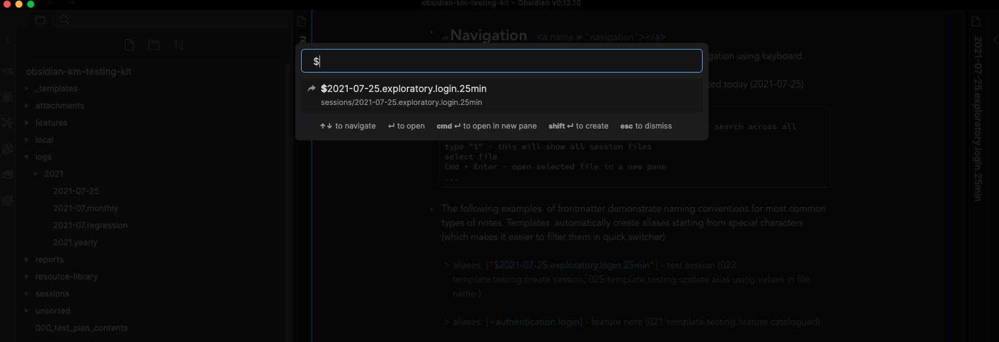
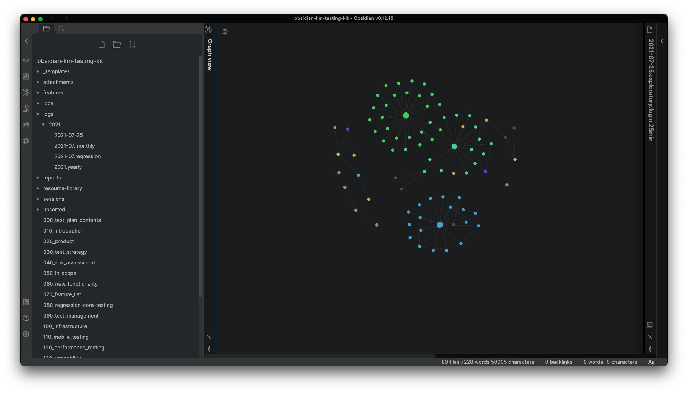

# Knowledge Management in Testing - Obsidian Starter Kit

## Table of Contents
+ [About](#about)
+ [Getting Started](#getting_started)
+ [Usage](#usage)
+ [Templates](#templates)
+ [Metadata](#metadata)
+ [Issues](#issues)

## About <a name = "about"></a>
This is an ObsidianMD starter kit (vault) for testers and QA enthusiasts. The main 2 goals are:
1. Share my templates, findings and  settings for ObsidianMD with other testers who also use that tool in their work.
2. To have a handy template in the cloud for myself. When I need to start a new testing project, I can download / clone this starter kit  from  GitHub. Without spending much time on settings and configurations  I can quickly start using it for my testing needs in less than 5 min.

The starter kit includes 
- preinstalled [Red Graphite Theme](https://github.com/seanwcom/Red-Graphite-for-Obsidian)
- preinstalled plugins
- predefined hotkeys
- [Templater ](https://silentvoid13.github.io/Templater/)scripts
- some heuristics (templates)
- some test charter examples (templates)
- sample folder structure and file name conventions

All of the above can be customized as per your needs and preferences.

## Getting Started <a name = "getting_started"></a>
These instructions will get you a copy of the starter kit up and running on your local machine so you can start using it.

Main steps include
1. Clone repo or download zip from GitHub. Unzip if you downloaded zip
2. Install [ObsidianMD ](https://obsidian.md/)on your machine (cross-platform support)
3. Launch ObsidianMD
4. On first launch when Safe mode warning appears click "Turn off Safe Mode"
5. Click "Open folder as a vault" and select the folder (obsidian-km-testing-kit)
6. Enjoy

Here is the screen you should see after step #5


## Usage <a name = "usage"></a>

Some hotkeys to get started. All commands in Obsidian can be accessed from command palette. Hotkeys can be customized by navigating to Settings (icon in the bottom left corner) > Hotkeys (below are Mac OS examples).

> Cmd + O - open quick switcher (dialog window with fuzzy search across all files in your vault)

> Cmd + W - close current note

> Cmd + click - open link in a new pane

> Cmd + E - toggle edit / preview mode

> Alt + Cmd + X -  insert Templater template

> Cmd + Shift + N - create note in a new pane 

> Cmd + L - open local graph view

> Ctr + D - delete current note (deleted notes can be found in ".trash" folder)

> Cmd + 1 - move list item up

> Cmd + 2 - move list item down

> Cmd + 4 - toggle line to bulleted or numbered list

> Cmd + Enter - toggle checklist status

> Cmd + Shift + D - duplicate line

> Alt + Cmd + M - move active note to another folder 

> Alt + Cmd + M - run MetaEdit plugin

> Alt + Cmd  + I - show developer console


## Templates <a name = "templates"></a>
All templates are split in 3 areas, located in "_templates/" folder. Feel free to correct them or add your own:
1. templates - templates to manage various types of notes, e.g. create test session note.
2. heuristics - each file contains a brief description of testing heuristic.
2. charters - each file contains a charter example.

Example:
```
Alt + Cmd + X -  insert Templater template
type 020
press Enter
select "session" using keyboard and press Enter or click the option
select "exploratory" using keyboard and press Enter or click the option
# session note will be created and moved to the folder "sessions/"
```


## Metadata  <a name = "metadata"></a>
Some examples describing how to work with metadata using [MetaEdit plugin](https://github.com/chhoumann/MetaEdit) and templates

1. Add or update YAML properties - press Alt + Cmd + M
2. Add Auto Properties  values selectable through a suggester - navigate to Settings > Plugin Options > MetaEdit > Auto Properties > click Settings icon. Then add properties and selectable values.

Here is example how to add  feature name to metadata of the session note created in previous example

```
Alt + Cmd + M - run MetaEdit plugin
type "f"
select "features" using keyboard and press Enter or click the option
select "untitled" using keyboard and press Enter or click the option
type feature name (no spaces, e.g. user-login)  or select "registration" using keyboard and press Enter or click the option
```

Rename filename using the name of the first feature in metadata ("features")

```
Alt + Cmd + X -  insert Templater template
type 024
select "024 template ... " using keyboard and press Enter or click the option
# session note file will be renamed 2021-07-25.exploratory.untitled.undefined → 2021-07-25.exploratory.login.25min
```


## Navigation  <a name = "navigation"></a>
Aliases (frontmatter fields at the top) can be used for quick navigation using keyboard.

This example shows how to quickly open test session note created today (2021-07-25)

```
Cmd + O - open quick switcher (dialog window with fuzzy search across all files in your vault)
type "$" - this will show all session files
select file
Cmd + Enter - open selected file in a new pane
```

The following examples  of frontmatter demonstrate naming conventions for most common types of notes. Templates  automatically create aliases starting from special characters (which makes it easier to filter them in quick switcher)

 > aliases: ["$2021-07-25.exploratory.login.25min"] - test session (023 template.testing.create session, 025 template.testing.update alias using values in file name )

 > aliases: [~authentication.login] - feature note (021 template.testing.feature catalogued)
 
> aliases: ["&2021-07-25"] - daily note, daily report (022 template.testing.daily note)

> aliases: ["#2021-07"] - monthly log (no template, see example [2021-07.monthly](logs/2021/2021-07.monthly.md))

> aliases: ["%2021-07.regression"] - monthly regression log (no template, see example [2021-07.regression](logs/2021/2021-07.regression.md))




## Issues <a name = "issues"></a>
Please report issues here
